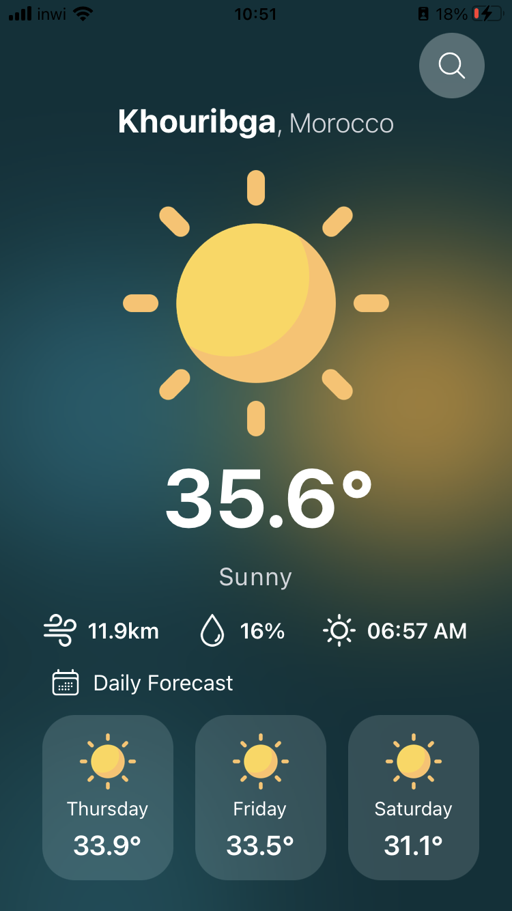
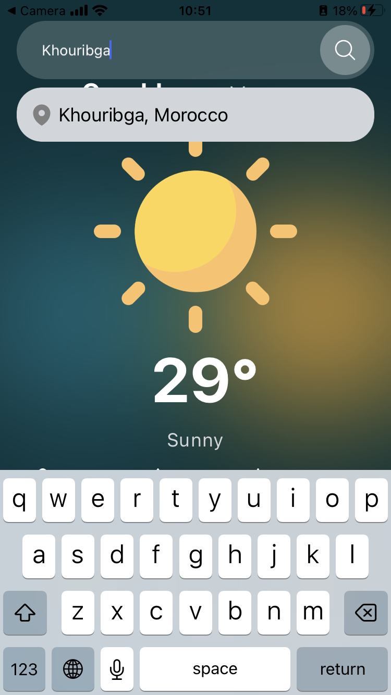
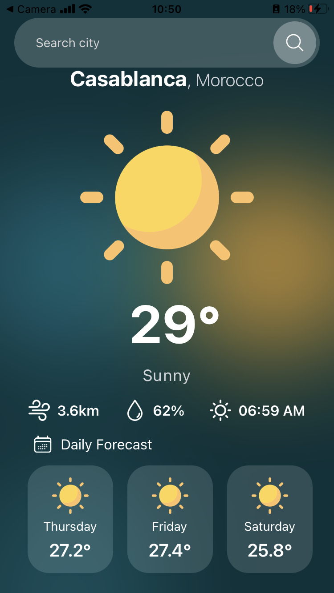
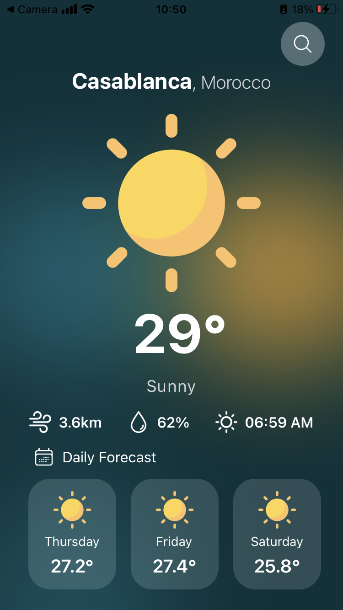

# Weather App - Week Weather Forecast
Welcome to the Weather App project! This application allows you to conveniently check the week's weather forecast for your city using the "weatherapi.com" API. Stay informed about the upcoming weather conditions so you can plan your activities accordingly.

## Features
- **City Selection**: Enter the name of your city to retrieve the week's weather forecast.
- **Detailed Information**: Get detailed daily weather information including temperature, humidity, wind speed, and more.
- **Visual Representation**: The app provides a visually appealing representation of the weather forecast, making it easy to grasp the upcoming weather patterns.

## Installation
- Clone the repository to your local machine using the following command:
```
    git clone https://github.com/your-username/weather-app.git
```
- Navigate to the project directory:
```
    cd weather-app
```
- Install dependencies by running:
```
    npm install
```

## Usage
- Obtain your API key from [weatherapi.com](https://www.weatherapi.com) by signing up for an account.
- Create **.env** file in the root directory and past your api key:
```
    API_KEY="YOUR API KEY HERE"
```
- Run your app:
    - Using **expo-cli**:
    ```
        expo start
    ```
    - Or Using by running this command:
    ```
        npx expo start
    ```
    - Scan expo QrCode by using expo mobile app
    - Enjoy :)

## Screenshots

<div>




</div>